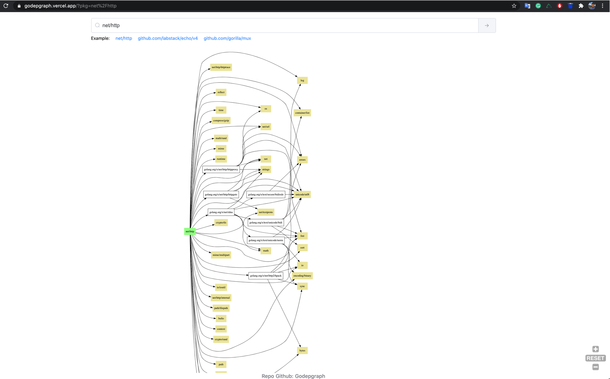
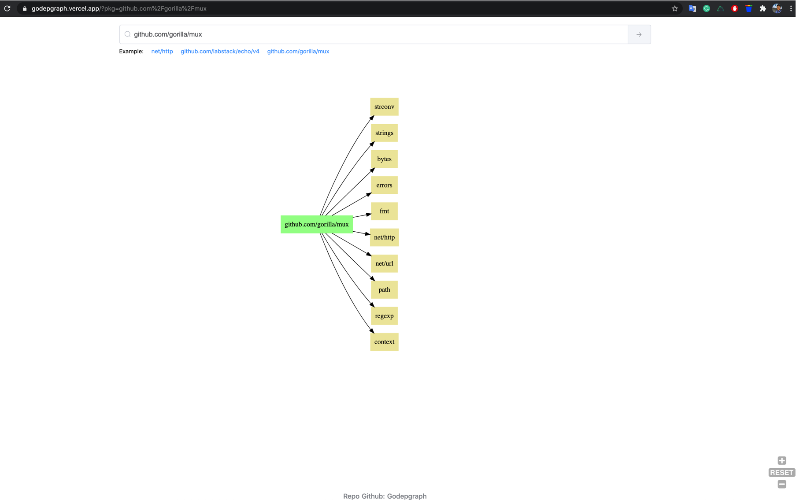

## Godepgraph

Godepgraph - Vizualize Go package from [https://pkg.go.dev](https://pkg.go.dev)

## Components

Backend: Golang
- [Fiber](https://fiber.wiki/)
- [godepviz](https://github.com/chuongtrh/godepviz)
- [bigcache](https://github.com/allegro/bigcache)
- Heroku deploy

Frontend: Nuxt.js
- [vue-svg-pan-zoom](https://github.com/yanick/vue-svg-pan-zoom)
- Host on Vercel

## Screenshots

